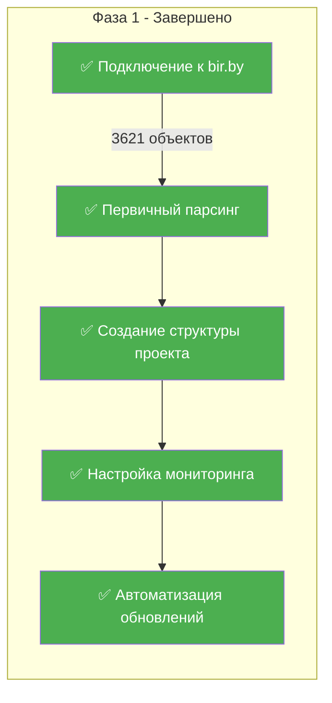
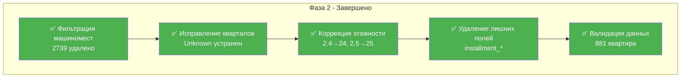
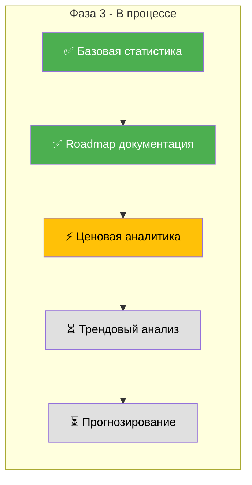
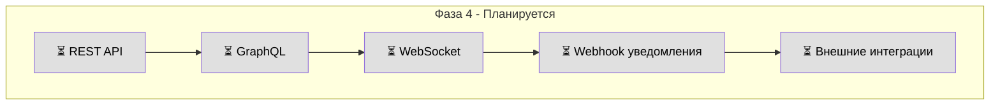
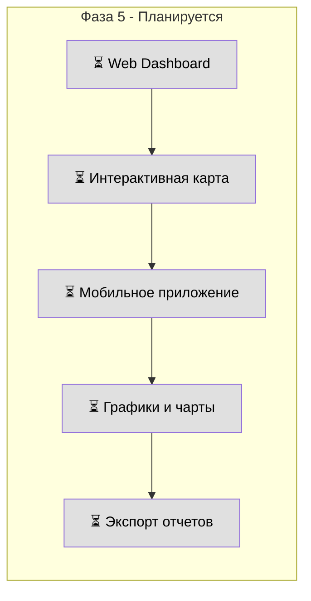
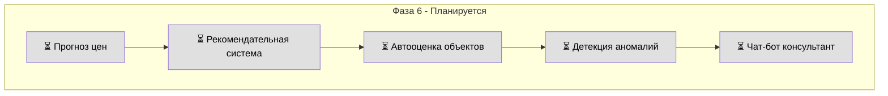
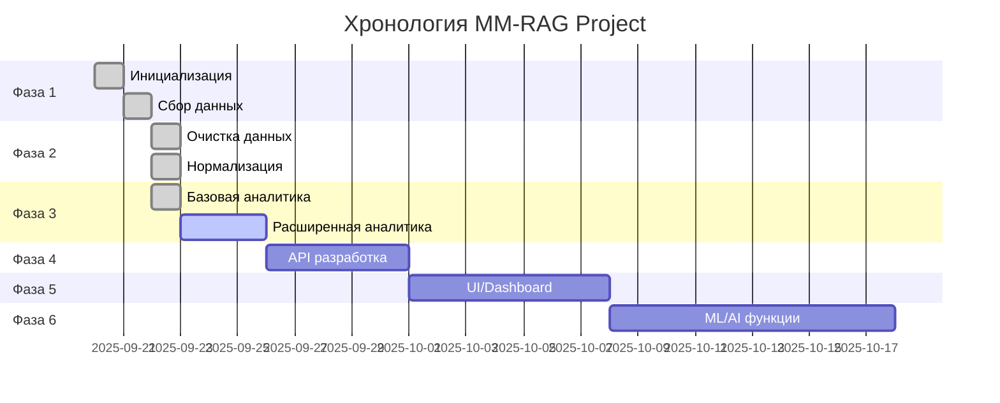

# 🚀 MM-RAG Project Roadmap - Этапы разработки

## 📊 Общий прогресс проекта: ████████░░ 80%

## 🗓️ Фаза 1: Инициализация и сбор данных ✅ (100%)

### Детализация выполненных задач:
- ✅ **Подключение к API** - Интеграция с bir.by/ai/json_ai.php
- ✅ **Парсинг данных** - Обработка 3621 объекта
- ✅ **Структура хранения** - JSON файлы по кварталам
- ✅ **Мониторинг** - Обновление каждые 5 минут
- ✅ **Логирование** - monitoring_log.txt + версионирование

---

## 🧹 Фаза 2: Очистка и нормализация данных ✅ (100%)

### Детализация выполненных задач:
- ✅ **Удалено 2739 машиномест** - Автоматическая фильтрация
- ✅ **Исправлены квартальные назначения**:
  - Диадема → 02-Эмиратс
  - Сидней Люкс 18.4 → 18-Чемпионов
  - Рио-де-Жанейро 18.7 → 18-Чемпионов
- ✅ **Исправлена этажность** - Все ошибки устранены
- ✅ **Оптимизирована структура** - Удалены неиспользуемые поля

---

## 📈 Фаза 3: Аналитика и отчетность ⚡ (60%)

### Статус задач:
- ✅ **Базовая статистика** - 881 квартира, 18 кварталов
- ✅ **Документация** - roadmap.md, roadmap-visual.md
- ⚡ **Ценовая аналитика** - Частично реализована
- ⏳ **Трендовый анализ** - Запланирован
- ⏳ **Прогнозирование спроса** - Запланировано

---

## 🔌 Фаза 4: API и интеграции ⏳ (0%)

### Планируемые задачи:
- ⏳ **REST API** - CRUD операции для квартир
- ⏳ **GraphQL** - Гибкие запросы данных
- ⏳ **WebSocket** - Реальное время обновления
- ⏳ **Webhooks** - Уведомления о изменениях
- ⏳ **Интеграции** - Telegram, Email, SMS

---

## 📱 Фаза 5: Визуализация и UI ⏳ (0%)

### Планируемые задачи:
- ⏳ **Web Dashboard** - React/Vue панель управления
- ⏳ **Карта кварталов** - Интерактивная визуализация
- ⏳ **Mobile App** - iOS/Android приложение
- ⏳ **Аналитические графики** - Chart.js/D3.js
- ⏳ **Экспорт** - PDF, Excel, CSV

---

## 🤖 Фаза 6: ML/AI функционал ⏳ (0%)

### Планируемые задачи:
- ⏳ **ML прогнозирование** - Предсказание цен
- ⏳ **Рекомендации** - Персонализированные предложения
- ⏳ **Автооценка** - Оценка новых объектов
- ⏳ **Аномалии** - Обнаружение подозрительных цен
- ⏳ **AI консультант** - Чат-бот для клиентов

---

## 📅 Timeline проекта

---

## 📊 Метрики успеха проекта

| Метрика | Цель | Текущее | Статус |
|---------|------|---------|--------|
| **Качество данных** | 100% | 100% | ✅ Достигнуто |
| **Автоматизация** | 100% | 100% | ✅ Достигнуто |
| **Покрытие кварталов** | 18/18 | 18/18 | ✅ Достигнуто |
| **API готовность** | 100% | 0% | ⏳ В планах |
| **UI/Dashboard** | 100% | 0% | ⏳ В планах |
| **ML функционал** | 100% | 0% | ⏳ В планах |

---

## 🎯 Приоритетные задачи на следующий спринт

### Высокий приоритет 🔴
1. [ ] Завершить ценовую аналитику по кварталам
2. [ ] Добавить детекцию изменений цен с уведомлениями
3. [ ] Реализовать экспорт данных в Excel/CSV

### Средний приоритет 🟡
4. [ ] Начать разработку REST API
5. [ ] Создать базовый web dashboard
6. [ ] Добавить графики трендов

### Низкий приоритет 🟢
7. [ ] Исследовать ML модели для прогнозирования
8. [ ] Прототип мобильного приложения
9. [ ] Интеграция с мессенджерами

---

## 🏆 Достижения проекта

### Выполнено на текущий момент:
- ✅ **2739 машиномест** успешно отфильтровано
- ✅ **100% данных** очищены и нормализованы
- ✅ **18 кварталов** полностью структурированы
- ✅ **881 квартира** готова к анализу
- ✅ **Автоматический мониторинг** работает 24/7
- ✅ **Версионирование** всех изменений

### Технический долг: 
- ⚠️ Нет тестового покрытия
- ⚠️ Отсутствует CI/CD
- ⚠️ Нет бэкапов базы данных
- ⚠️ Требуется оптимизация запросов

---

## 📝 Легенда

- ✅ **Завершено** - Задача полностью выполнена
- ⚡ **В процессе** - Активная работа
- ⏳ **Запланировано** - В очереди на выполнение
- ⚠️ **Требует внимания** - Технический долг

---

*Последнее обновление: 2025-09-22 | Версия: 1.0*