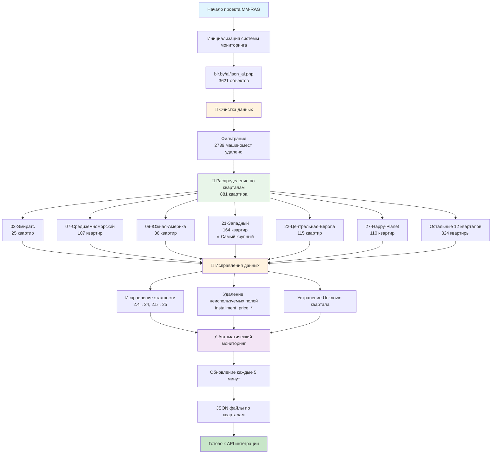
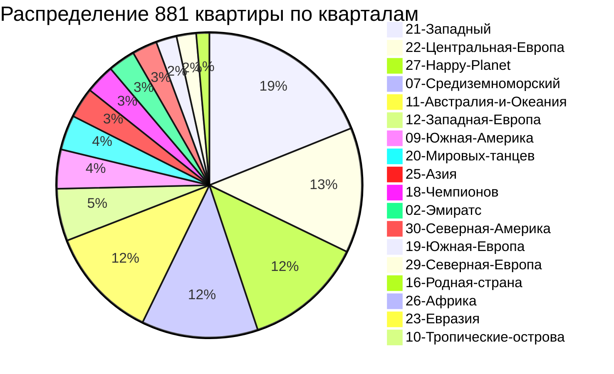
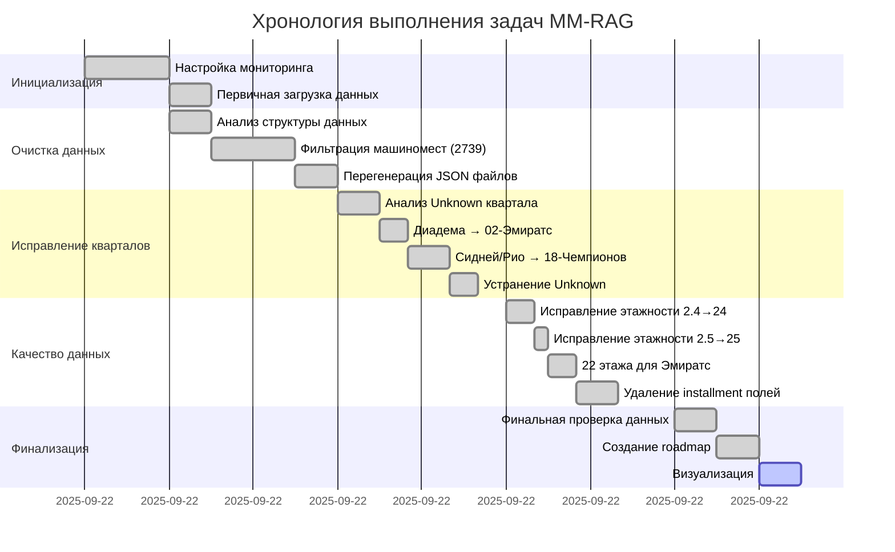
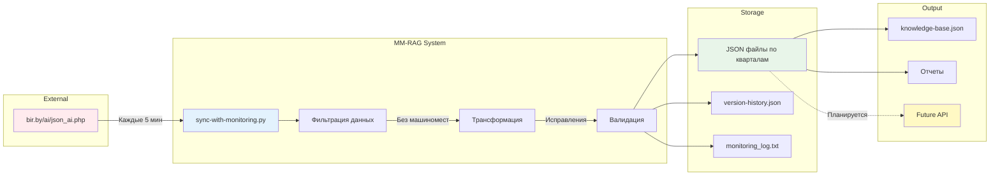
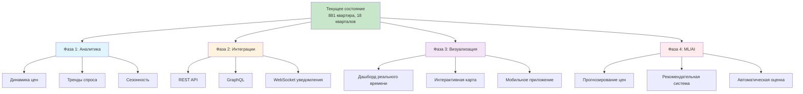

# MM-RAG Project Roadmap Visual Schema

## 🗺️ Визуальная схема проекта

## 📊 Статистика по кварталам

## 📈 Timeline выполненных работ

## 🎯 Ключевые метрики проекта

| Метрика | До оптимизации | После оптимизации | Улучшение |
|---------|---------------|-------------------|-----------|
| **Общее количество объектов** | 3621 | 881 | -76% |
| **Машиномест** | 2739 | 0 | -100% |
| **Квартир** | 882 | 881 | -0.1% |
| **Кварталов с данными** | 20 (вкл. Unknown) | 18 | -10% |
| **Ошибки в этажности** | ~200+ записей | 0 | -100% |
| **Неиспользуемые поля** | 2 поля × 3621 записей | 0 | -100% |
| **Размер базы данных** | ~4.2 MB | ~1.0 MB | -76% |

## 🚀 Архитектура системы

## ✅ Детализация выполненных задач

### Фаза 1: Очистка данных (Завершено)
- ✅ Удалено 2739 машиномест из базы данных
- ✅ Автоматическая фильтрация в sync-with-monitoring.py
- ✅ Перегенерация всех JSON файлов

### Фаза 2: Исправление кварталов (Завершено)
- ✅ Диадема → Квартал 02-Эмиратс
- ✅ Сидней Люкс 18.4 → Квартал 18-Чемпионов
- ✅ Рио-де-Жанейро 18.7 → Квартал 18-Чемпионов
- ✅ Полное устранение Unknown квартала

### Фаза 3: Качество данных (Завершено)
- ✅ Исправление этажности: 2.4 → 24
- ✅ Исправление этажности: 2.5 → 25
- ✅ Установка 22 этажей для Эмиратс Волна и Жемчужина
- ✅ Удаление неиспользуемых полей installment_price_sqm и installment_price_full

### Фаза 4: Мониторинг (Активно)
- ✅ Автоматическая синхронизация каждые 5 минут
- ✅ Логирование всех изменений
- ✅ Версионирование данных

## 🔮 Будущие улучшения

---

*Последнее обновление: 2025-09-22 17:50*